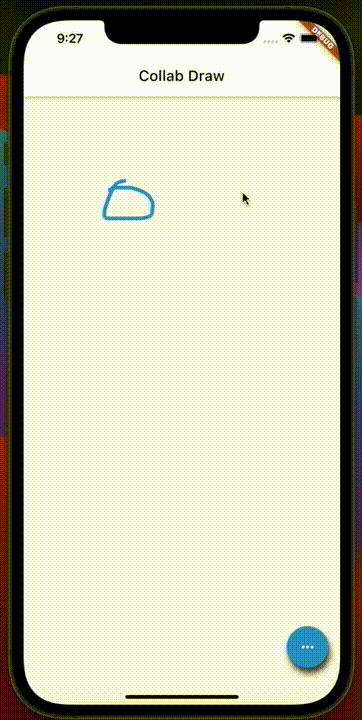
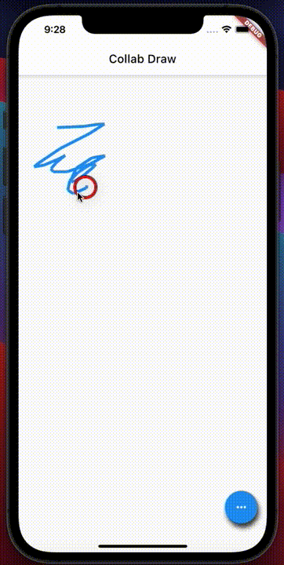
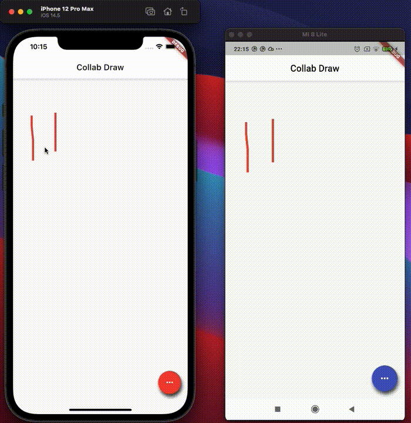

# Collaborative Drawing App

This project is collaborative drawing app that uses WenSocket to receive and draw other user's drawing.
It was made basically using [CustomPaint](https://api.flutter.dev/flutter/rendering/CustomPainter-class.html) and [RxDart](https://pub.dev/packages/rxdart).

# Features

| **Drawing + Undo/Redo** | **Change color**  |
|:---:|:---:|
| | |

| **Collaborative iOS and Android** |
|:---:|
| |
